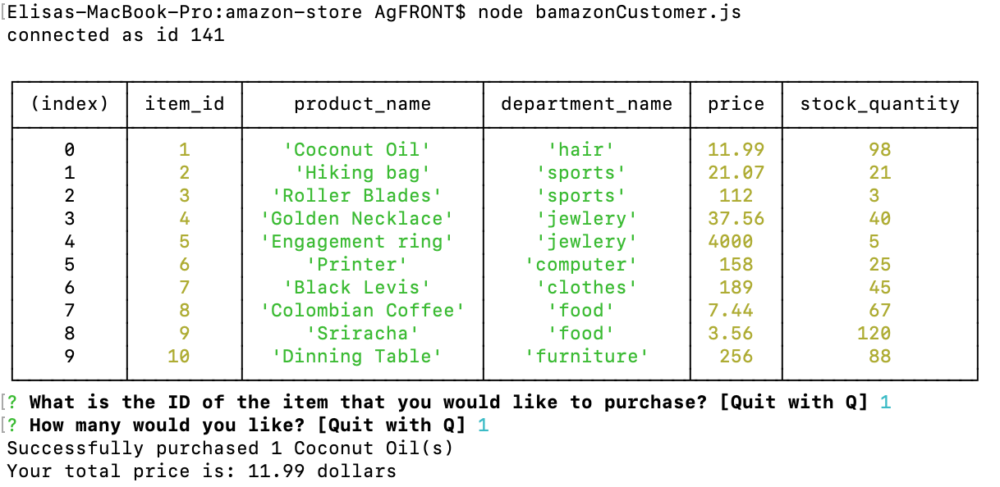

# Amazon-store

## Overview of how this app works and why it was built

This app was built to keep track of customer's purchases and of stock inventory. It will automatically update the stock quantity based on the user's input of purchased items. 

It requires that the user have internet access, terminal installed on their computer and mysql server

The user will also need to install the following npm packages: inquirer and mysql.

## How the app is organized

Via the command lines, the app is able to receive user's input of product id and quantity and post updated information back to the console.

## How to use this app

1) Create a database and table of your choice (schema.sql has mock data) on mysql
2) Install inquirer and mysql using npm packages
3) Command line to type:

node 'bamazonCustomer.js 

4) The following screen will appear:

## Link to the video of how it works:
https://drive.google.com/open?id=1jstWdpcLCpBzXGhFQIZGQiyFTftqyCHS

## Link to the deployed version of the app
https://efemar.github.io/amazon-store/

## Technologies used in the App
This app was built using javascript and node.js. It requires that the use have internet access, terminal and mysql.

## Contributor
This app was built by Elisa Marques, github: https://github.com/efemar?tab=repositories